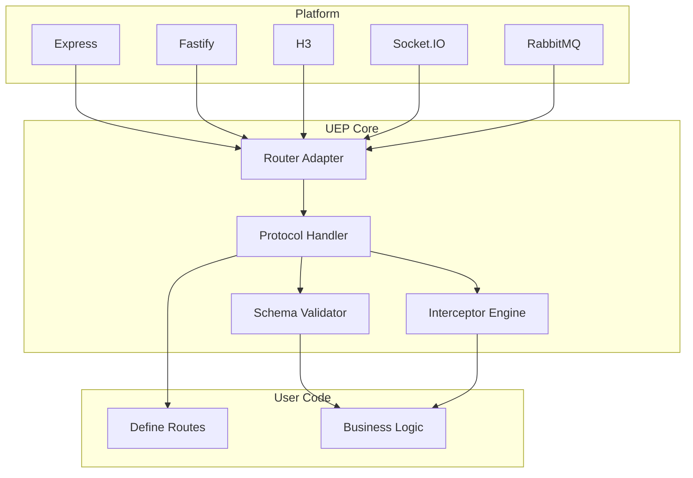

# UEP — Unleashed Exagonal Protocol

>[!WARNING]
> This maybe on pendding development since i have no time

[](https://github.com/albasyir/uep/actions/workflows/test.yml)

**UEP** is a modern platform abstraction layer designed to unify HTTP, Realtime, and Messaging systems under one powerful protocol-inspired architecture.

Think: Express + Fastify + Socket.IO + RabbitMQ... all in one plug-and-play interface — portable, interceptable, and 100% modular.


## ✨ Why "UEP"? What is *Exagonal*?

UEP stands for **Unleashed Exagonal Protocol**.

Unlike the traditional "Hexagonal Architecture" which focuses on Ports and Adapters, **Exagonal** is our evolved take — where protocols, interceptors, and platform behavior are first-class citizens.

>[!INFO]
> Not just Hexagonal. It's **Exagonal** — a boundary-less, scalable, plug-aware system that embraces both structure and freedom.

We intentionally dropped the "H" to show:  
- it's **not a copy**,  
- it's **not just theory**,  
- it's **a flexible protocol engine** built for real-life architecture.


## 🔧 Key Features

- 🔌 **Pluggable Platform Support**
  - HTTP: Express, Fastify (wotking now but experimental)
  - Realtime: Socket.IO (in plan, need to make standard first)
  - Messaging: RabbitMQ (fixed plan, soon)
  - more will comming

- 🔌 **Pluggable Runtime Support** (unit test passed for now)
  - NodeJS 
  - Bun 
  - Deno (passed with warning)

- 🧩 **Composable Middleware & Hook System** (soon)
  - Intercept Before and After
  - Validation included

- 🛡️ **Unified Schema Validation** (soon)
  - Zod-first, type-safe across body, params, query

- 🔁 **Protocol-Oriented, Not Framework-Locked**
  - Build once, run on any platform


## 🧭 Architecture Overview

from this architecture you can see we will focus on bussines and routing instead of overthinking about everything




## 📦 Packages

```bash
@uep/manager
@uep/http-express-platform
@uep/http-fastify-platform
@uep/broker-rabbitmq-platform
